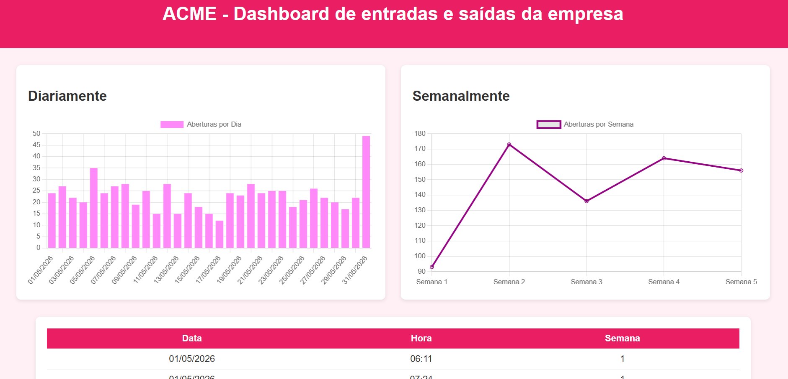

# 📚 Atividades — Tinkercad, Web

Este repositório contém as atividades práticas das aulas 02, 03 e 04, com foco em eletrônica (Tinkercad) e desenvolvimento web (HTML, CSS, JavaScript e manipulação de dados (CSV)).

# Aula 02
### Simulação 01 - Trabalhando com mais alguns componentes
Nesta atividade foi montado um circuito no Tinkercad utilizando um transistor NPN, um LDR e um LED. O objetivo foi simular o funcionamento de um poste automático, onde o LDR detecta a luminosidade do ambiente e o transistor controla o LED. Assim, quando há pouca luz, o LED acende, e quando há bastante luz, ele apaga ou diminui sua intensidade.
## Simulação 02 - Cricuito simples com interruptor e dois leds
Nesta atividade foi montado um circuito no Tinkercad utilizando uma bateria de 9 V, um interruptor, dois LEDs e resistores. O objetivo foi controlar os LEDs por meio do interruptor, fazendo com que um deles acenda enquanto o outro permanece apagado. A atividade ajudou a entender de forma simples o funcionamento de um circuito de acionamento.
## Simulação 03 - Circuito utilizando capacitor para causar um atraso na troca dos LEDs
Nesta atividade foi montado um sinalizador de saída de garagem utilizando um transistor NPN, um capacitor, dois LEDs e resistores. O capacitor foi utilizado para criar um atraso na troca dos LEDs, fazendo com que a mudança entre as sinalizações aconteça depois de alguns segundos.
## Atividade
Réplica do circuito do sinalizador de garagem utilizando o Arduino UNO e os componentes listados acima. Teste o código fornecido e observe o funcionamento dos LEDs.

### Código
```text
int verde = 8;
int vermelho = 2;

void setup()
{
  pinMode(verde, OUTPUT);
  pinMode(vermelho, OUTPUT);
}

void loop()
{
  digitalWrite(verde, 1);
  digitalWrite(vermelho, 0);
  delay(1000);
  digitalWrite(verde, 0);
  digitalWrite(vermelho, 1);
  delay(1000);
}
```
### Imagem do Tinkercad


---
# Aula 03
### Situação Problema 01 - Semáforo de duas vias
Nesta atividade foi desenvolvido um sistema de semáforo para organizar o fluxo de veículos na entrada de um condomínio. Foram utilizados dois semáforos controlados pelo mesmo Arduino UNO, programados para funcionar de forma sincronizada e evitar que os dois fiquem verdes ao mesmo tempo.
Também foram adicionados LEDs para representar a travessia de pedestres, que ficam verdes somente quando o semáforo de veículos está vermelho. A atividade permitiu praticar a programação do Arduino e o controle de vários LEDs de forma organizada.
### Código
```text
const int verdeE = 8;
const int amareloE = 9;
const int vermelhoE = 10;

const int verdeD = 13;
const int amareloD = 12;
const int vermelhoD = 11;

void setup() {
  pinMode(verdeE, OUTPUT);
  pinMode(amareloE, OUTPUT);
  pinMode(vermelhoE, OUTPUT);
  pinMode(verdeD, OUTPUT);
  pinMode(amareloD, OUTPUT);
  pinMode(vermelhoD, OUTPUT);
}

void loop() {
  digitalWrite(verdeE, HIGH);
  digitalWrite(amareloE, LOW);
  digitalWrite(vermelhoE, LOW);

  digitalWrite(verdeD, LOW);
  digitalWrite(amareloD, LOW);
  digitalWrite(vermelhoD, HIGH);

  delay(5000);

  digitalWrite(verdeE, LOW);
  digitalWrite(amareloE, HIGH);
  delay(2000);
  digitalWrite(amareloE, LOW);

  digitalWrite(vermelhoE, HIGH);
  digitalWrite(vermelhoD, HIGH);
  delay(2000);

  digitalWrite(vermelhoE, HIGH);
  digitalWrite(verdeD, HIGH);
  digitalWrite(amareloD, LOW);
  digitalWrite(vermelhoD, LOW);
  delay(5000);

  digitalWrite(verdeD, LOW);
  digitalWrite(amareloD, HIGH);
  delay(2000);
  digitalWrite(amareloD, LOW);

  digitalWrite(vermelhoE, HIGH);
  digitalWrite(vermelhoD, HIGH);
  delay(2000);
}

```
---
### Situação Problema 02 - Acendendo as luzes da pista de pouso
Nesta atividade foi desenvolvido um circuito que simula as luzes de uma pista de pouso. Foi utilizado um fotorresistor para detectar a quantidade de luminosidade do ambiente e controlar 10 LEDs.
Durante a simulação, conforme a luminosidade aumenta, os LEDs começam a se apagar. Dessa forma, o circuito representa um sistema automático de iluminação, que acende as luzes quando está escuro e as reduz conforme o ambiente fica mais claro.
### Código
```text
const int ldrPin = A0;

const int leds[] = {2, 3, 4, 5, 6, 7, 8, 9, 10, 11};

void setup() {
  for (int i = 0; i < 10; i++) {
    pinMode(leds[i], OUTPUT);
  }
  pinMode(ldrPin, INPUT);
}

void loop() {
  int luz = analogRead(ldrPin);

  int numLeds = map(luz, 0, 1023, 10, 0);

  for (int i = 0; i < 10; i++) {
    if (i < numLeds) {
      digitalWrite(leds[i], HIGH);
    } else {
      digitalWrite(leds[i], LOW);
    }
  }

  delay(100);
}
```
---
### Desafio-Farol de Pedestre
O semáforo de pedestres foi utilizado para controlar a travessia com segurança. A luz vermelha indica que o pedestre deve esperar, enquanto a luz verde permite a travessia.
No circuito, o sinal verde para pedestres é acionado somente quando os dois semáforos de veículos estão vermelhos, evitando que veículos e pedestres tenham passagem ao mesmo tempo.
### Código
```text
const int verdeE = 8;
const int amareloE = 9;
const int vermelhoE = 10;

const int verdeD = 13;
const int amareloD = 12;
const int vermelhoD = 11;

const int verdePed = 7;
const int vermelhoPed = 6;

void setup() {
  pinMode(verdeE, OUTPUT);
  pinMode(amareloE, OUTPUT);
  pinMode(vermelhoE, OUTPUT);
  pinMode(verdeD, OUTPUT);
  pinMode(amareloD, OUTPUT);
  pinMode(vermelhoD, OUTPUT);
  pinMode(verdePed, OUTPUT);
  pinMode(vermelhoPed, OUTPUT);
}

void loop() {
  digitalWrite(verdeE, HIGH);
  digitalWrite(amareloE, LOW);
  digitalWrite(vermelhoE, LOW);

  digitalWrite(verdeD, LOW);
  digitalWrite(amareloD, LOW);
  digitalWrite(vermelhoD, HIGH);

  digitalWrite(verdePed, LOW);
  digitalWrite(vermelhoPed, HIGH);
  delay(5000);

  digitalWrite(verdeE, LOW);
  digitalWrite(amareloE, HIGH);
  delay(2000);
  digitalWrite(amareloE, LOW);

  digitalWrite(vermelhoE, HIGH);
  digitalWrite(vermelhoD, HIGH);
  digitalWrite(verdePed, HIGH);
  digitalWrite(vermelhoPed, LOW);
  delay(4000);
  digitalWrite(verdePed, LOW);
  digitalWrite(vermelhoPed, HIGH);

  digitalWrite(vermelhoE, HIGH);
  digitalWrite(verdeD, HIGH);
  digitalWrite(amareloD, LOW);
  digitalWrite(vermelhoD, LOW);
  delay(5000);

  digitalWrite(verdeD, LOW);
  digitalWrite(amareloD, HIGH);
  delay(2000);
  digitalWrite(amareloD, LOW);

  digitalWrite(vermelhoE, HIGH);
  digitalWrite(vermelhoD, HIGH);
  digitalWrite(verdePed, HIGH);
  digitalWrite(vermelhoPed, LOW);
  delay(4000);
  digitalWrite(verdePed, LOW);
  digitalWrite(vermelhoPed, HIGH);
}
```
### Imagem do Tinkercad


---

# Aula 04
### Experimento 01 - Micro Servo e Potenciômetro
Nesta atividade foi desenvolvido um circuito utilizando um Micro Servo e um potenciômetro de 1 kΩ. O objetivo foi controlar o movimento do servo conforme o potenciômetro é girado.
Também foi utilizado um capacitor de 100 mF para auxiliar no funcionamento do circuito. A atividade envolveu a montagem do circuito no Tinkercad e a programação do Arduino para controlar o ângulo do Micro Servo.
### Código
```text
#include <Servo.h>
int potenc = 0; 
Servo servo; 

void setup(){
  servo.attach(11); 
} 


void loop(){ 
    

  potenc = analogRead(0); 
  

  int angulo = map(potenc, 0, 1023, 0, 180); 
  

  servo.write(angulo); 

} 
```
---
### Experimento 02 - Display de 7 segmentos

Nesta atividade foi utilizado um Arduino UNO conectado a um display de 7 segmentos. O objetivo foi criar um contador de 0 a 9, utilizando um botão para avançar os números.
Foram utilizados resistores para proteger os LEDs internos do display e um resistor ligado ao botão. Ao pressionar o botão, o número exibido no display aumenta até chegar a 9 e depois retorna para 0.
### Código
```text
int a = 4, b = 5, c = 6, d = 7, e = 8, f = 9, g = 10;
int botao = 2;
int num = 0;
int entrada[7] = {a,b,c,d,e,f,g};
int display[10][7] = {{a,b,c,d,e,f},{b,c},{a,b,d,e,g},{a,b,c,d,g},{b,c,f,g},{a,c,d,f,g},{a,c,d,e,f,g},{a,b,c},{a,b,c,d,e,f,g},{a,b,c,f,g}};
void setup() {
	for(int i=0;i<7;i++) pinMode(entrada[i],OUTPUT);
	pinMode(botao,INPUT);
}
void loop() {
	int click = digitalRead(botao);
	delay(100); 
	if(click) num++;
	if(num < 10) numero(num); else num = 0;
}
void numero(int coluna) {
	for(int i=0;i<7;i++) digitalWrite(entrada[i],1);
	for(int linha=0;linha<7;linha++){
		digitalWrite(display[coluna][linha],0);
	}
}
```
---

### Desafio - Display com Potenciômetro e Dois Displays

Neste desafio, o botão foi substituído por um potenciômetro, que permite controlar o valor exibido no display de 0 a 9 conforme é girado.
Em seguida, foi adicionado mais um display para ampliar o contador, permitindo representar números de 00 a 99. O objetivo foi utilizar o Arduino para controlar os dois displays e realizar a contagem de duas casas.
### Código
```text
const int segmentos[] = {2, 3, 4, 5, 6, 7, 8};

const int displayDezena = 9;
const int displayUnidade = 10;

const int potenciometro = A0;

// Números de 0 a 9
// A, B, C, D, E, F, G
const byte numeros[10][7] = {
  {1, 1, 1, 1, 1, 1, 0}, // 0
  {0, 1, 1, 0, 0, 0, 0}, // 1
  {1, 1, 0, 1, 1, 0, 1}, // 2
  {1, 1, 1, 1, 0, 0, 1}, // 3
  {0, 1, 1, 0, 0, 1, 1}, // 4
  {1, 0, 1, 1, 0, 1, 1}, // 5
  {1, 0, 1, 1, 1, 1, 1}, // 6
  {1, 1, 1, 0, 0, 0, 0}, // 7
  {1, 1, 1, 1, 1, 1, 1}, // 8
  {1, 1, 1, 1, 0, 1, 1}  // 9
};

void setup() {
  for (int i = 0; i < 7; i++) {
    pinMode(segmentos[i], OUTPUT);
  }

  pinMode(displayDezena, OUTPUT);
  pinMode(displayUnidade, OUTPUT);

  digitalWrite(displayDezena, LOW);
  digitalWrite(displayUnidade, LOW);
}
void mostrarNumero(int numero) {

  for (int i = 0; i < 7; i++) {
    digitalWrite(segmentos[i], numeros[numero][i]);
  }

}

void loop() {
  int leitura = analogRead(potenciometro);

  int valor = map(leitura, 0, 1023, 0, 99);

  int dezena = valor / 10;
  int unidade = valor % 10;

  digitalWrite(displayUnidade, LOW);

  mostrarNumero(dezena);

  digitalWrite(displayDezena, HIGH);

  delay(5);

  digitalWrite(displayDezena, LOW);

  digitalWrite(displayDezena, LOW);

  mostrarNumero(unidade);

  digitalWrite(displayUnidade, HIGH);

  delay(5);

  digitalWrite(displayUnidade, LOW);
}
```
### Imagem do Tinkercad


---
## Análise de Dados - Web UI

Nesta atividade foi desenvolvida uma interface Web para visualizar e analisar os dados de funcionamento de um portão eletrônico. A proposta foi utilizar os dados do arquivo `dados.csv` para criar um Dashboard com gráficos que facilitam a visualização das informações.

Foram utilizados HTML, CSS e JavaScript para criar a interface, podendo também ser utilizado um framework como React com Vite.

### Desafio

O Dashboard deveria apresentar pelo menos dois gráficos:

- Um gráfico mostrando a atividade do portão diariamente.
- Um gráfico mostrando a atividade do portão semanalmente.

Os gráficos foram desenvolvidos com base no wireframe disponibilizado na atividade, utilizando os dados presentes no arquivo `dados.csv`.<br>
Link para acesso:
https://gabriellypiffer.github.io/Atividades_IOT/
### Wireframe



---
